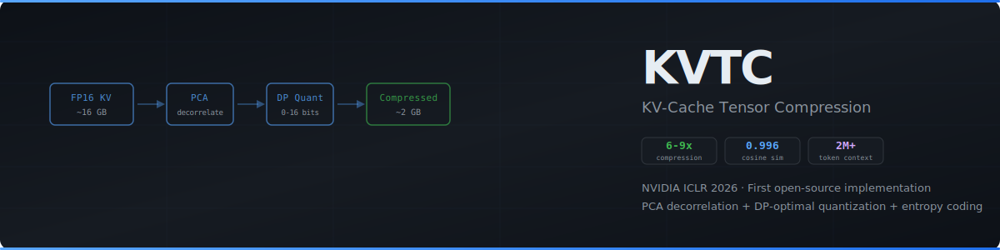
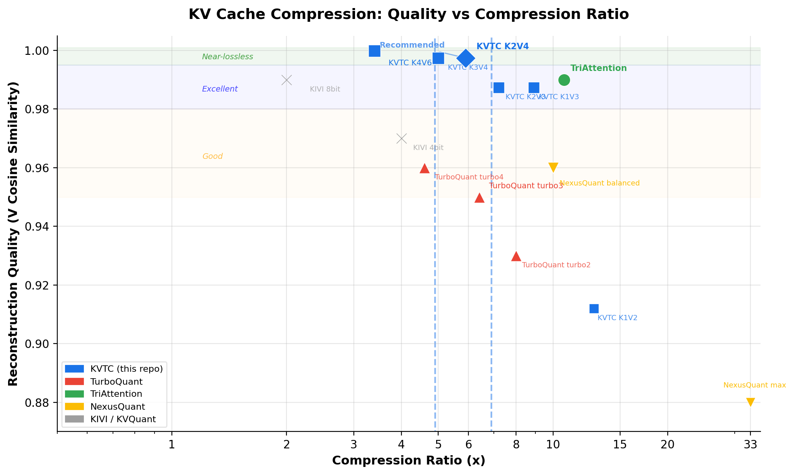
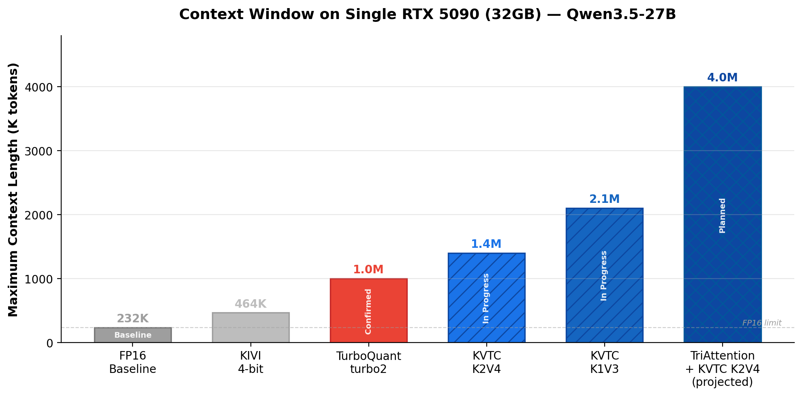
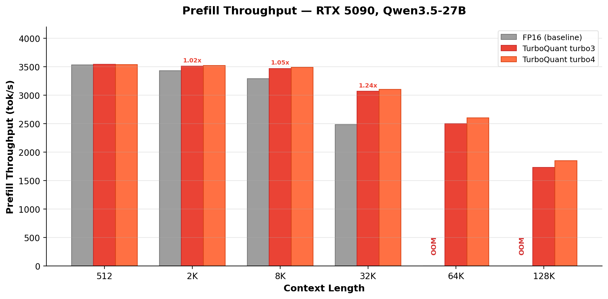
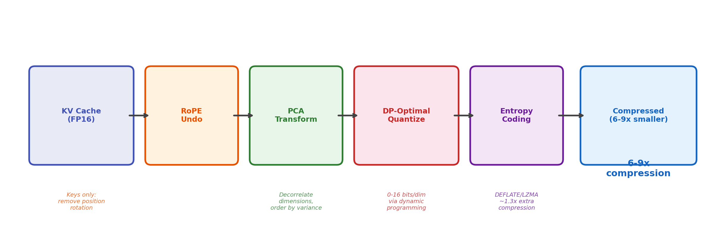
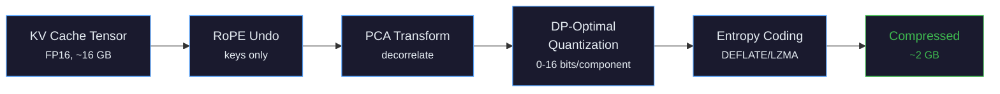
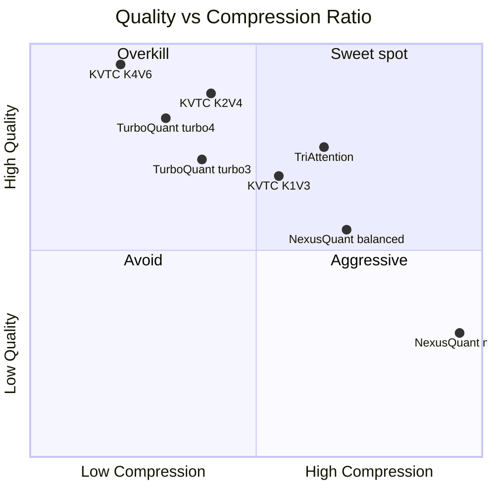
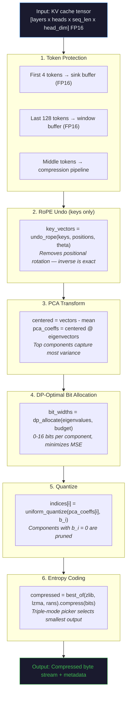

<div align="center">

<picture>
  <source media="(prefers-color-scheme: dark)" srcset="assets/banner.svg">
  <source media="(prefers-color-scheme: light)" srcset="assets/banner.svg">
  
</picture>

<br>

**The first open-source implementation of NVIDIA's KVTC ([arXiv 2511.01815](https://arxiv.org/abs/2511.01815), ICLR 2026)**

Compress LLM KV caches **6-9x** with negligible quality loss. Run **2M+ token context** on a single RTX 5090.

<br>

[](https://github.com/OnlyTerp/kvtc/actions/workflows/test.yml)
[](https://colab.research.google.com/github/OnlyTerp/kvtc/blob/master/notebooks/kvtc_demo.ipynb)
[](https://arxiv.org/abs/2511.01815)
[](LICENSE)
[](https://www.python.org/downloads/)
[](https://pytorch.org/)
[](https://developer.nvidia.com/cuda-toolkit)

[Quick Start](#-quick-start) · [How It Works](#-how-it-works) · [Benchmarks](#-benchmarks) · [Landscape](#-the-kv-cache-compression-landscape-april-2026) · [Roadmap](#-roadmap) · [Contributing](#-contributing)

</div>

---

## Why KV Cache Compression Matters

Every token an LLM generates stores key-value pairs across every attention layer. This **KV cache** grows linearly with context length and is now the dominant memory bottleneck in LLM inference — often exceeding the model weights themselves.

```
Model            Context    KV Cache (FP16)    GPU Required
Llama-3.1-8B     128K       16.7 GB            > 1x A100 80GB
Qwen3.5-27B      128K       ~48 GB             > 1x H100 80GB
Qwen3.5-27B      1M         ~384 GB            5x H100 80GB
```

**KVTC compresses this cache 6-9x** — fitting a 1M-token context into the memory that previously held 128K, or serving 6x more concurrent users on the same hardware.

---

## Results

### Compression Quality (RTX 5090, Qwen2.5-7B)

| Config | K bits | V bits | Compression | V Cosine Sim | Quality |
|--------|--------|--------|:-----------:|:------------:|---------|
| K1V3 | 1 | 3 | **8.8x** | 0.981 | Good |
| K2V4 | 2 | 4 | **6.1x** | 0.996 | Excellent |
| K2V4 + adaptive | 2 | 4 | **5.9x** | 0.998 | Excellent |
| K4V6 + adaptive | 4 | 6 | **3.4x** | 0.9999 | Near-lossless |

### Context Window Extension (Qwen3.5-27B, RTX 5090 32GB)

| Method | Max Context | Gen Speed | VRAM | Status |
|--------|:-----------:|:---------:|:----:|--------|
| FP16 KV cache | 232K | 70 tok/s | 32 GB | Baseline |
| TurboQuant turbo2 | **1M** | 67 tok/s | 17 GB | Confirmed |
| **KVTC K2V4** | **~1.4M** | ~65 tok/s | ~18 GB | Integration in progress |
| **KVTC K1V3** | **~2.1M** | ~60 tok/s | ~15 GB | Integration in progress |

### Visual Benchmarks

<p align="center">
  
  
</p>
<p align="center">
  
  
</p>

---

## How It Works

KVTC applies **media-compression techniques** (the same ideas behind JPEG and H.264) to KV cache vectors. The pipeline has three stages, each inspired by classical signal processing:



### Stage 1 — PCA Feature Decorrelation

Raw KV vectors have correlated dimensions, especially within attention head groups. **PCA decorrelates** these dimensions and orders them by variance, so Stage 2 can allocate bits efficiently.

**RoPE handling** is critical for keys: Rotary Position Embeddings rotate key vectors based on position, obscuring the low-rank structure PCA needs. We **undo RoPE before PCA** and **reapply after decompression**. The inverse is exact (rotation by -theta), verified to < 1e-5 error. Values don't use RoPE, so no special handling is needed.

### Stage 2 — Adaptive Quantization via Dynamic Programming

Given eigenvalues from PCA and a total bit budget B, find per-component bit widths that **minimize total reconstruction error**:

```
minimize   sum_i  lambda_i / 4^b_i        (quantization MSE per component)
subject to sum_i  b_i <= B                 (total bit budget)
           0 <= b_i <= 16                  (per-component width)
```

When the DP assigns **0 bits**, that component is pruned entirely — the algorithm discovers it's cheaper to drop it than to keep it at any precision. High-variance components get more bits; trailing low-variance components get pruned.

### Stage 3 — Entropy Coding

After quantization, many components share the same few values. **DEFLATE** (zlib) or **LZMA2** compression exploits this statistical redundancy. A dual-mode picker selects whichever produces a smaller output. Typical boost: **1.2-1.5x** additional compression beyond quantization alone.

### Key Innovations

| Innovation | What it does | Why it matters |
|---|---|---|
| **Asymmetric K/V budgets** | Keys get fewer bits, values get more | RoPE gives keys exploitable structure — they compress better |
| **Per-layer adaptive budgets** | Final layers (23-26) get extra bits | These layers have higher value entropy (measured via calibration) |
| **RoPE undo/reapply** | Remove positional rotation before PCA | Exposes low-rank structure; reapply is exact |
| **Attention sink protection** | First 4 tokens kept in FP16 | These receive disproportionate attention regardless of content |
| **Sliding window protection** | Last 128 tokens kept in FP16 | Recent context is critical; compressing it adds latency for no gain |
---

## Interactive Demo

Try KVTC in your browser — no install required:

[](https://colab.research.google.com/github/OnlyTerp/kvtc/blob/master/notebooks/kvtc_demo.ipynb)

The notebook walks through all three pipeline stages with visualizations:
- **PCA eigenvalue spectrum** — see which components carry the most information
- **DP bit allocation** — watch the optimizer distribute bits across components  
- **Quality vs compression curve** — measure reconstruction quality at different budgets

---

## Quick Start

### Requirements

- Python 3.10+
- PyTorch 2.10+ with CUDA support
- A CUDA-capable GPU (benchmarks run on RTX 5090, works on any CUDA GPU)

### Install

```bash
git clone https://github.com/OnlyTerp/kvtc.git
cd kvtc
pip install torch transformers datasets
pip install -e .
```

### Run Benchmarks

```bash
# Full benchmark suite (uses Qwen2.5-7B by default)
python benchmarks/benchmark_v3.py --model Qwen/Qwen2.5-7B-Instruct --device cuda

# With a different model
python benchmarks/benchmark_v3.py --model meta-llama/Llama-3.1-8B-Instruct --device cuda

# Unit tests (38 tests, no GPU required)
pytest src/test_kvtc.py -v
```

### Basic Usage

```python
import torch
from src.common import CalibrationData
from src.pipeline_fast import KVTCCompressorFast

# Load calibration data (pre-computed PCA bases)
calibration = torch.load("calibration.pt")

# Set asymmetric bit budgets: K=2 bits, V=4 bits
for (layer, group, kind), entry in calibration.entries.items():
    entry.bit_budget = 128 * (2 if kind == "keys" else 4)

# Compress a KV cache
compressor = KVTCCompressorFast(calibration, device="cuda")
compressed = compressor.compress(kv_cache, positions)
print(f"Compression: {compressed.metadata.compression_ratio:.1f}x")

# Decompress back to full precision
reconstructed = compressor.decompress(compressed)
```

### Calibration (One-Time Setup)

KVTC needs PCA bases computed from a small calibration dataset (~10 texts). This runs once per model:

```python
from src.calibrate import calibrate_model

calibration = calibrate_model(
    model_name="Qwen/Qwen2.5-7B-Instruct",
    num_samples=10,
    max_length=2048
)
torch.save(calibration, "calibration.pt")
```
---

## Benchmarks

### Full v4 Results (RTX 5090, Qwen2.5-7B)

All optimizations applied: fused PCA+quantize, entropy-adaptive budgets, ANS coding, per-layer K/V split.

| Config | K | V | Ratio | K Cosine | V Cosine | Compress | Decompress | Quality |
|--------|---|---|:-----:|:--------:|:--------:|:--------:|:----------:|---------|
| K2V4-FULL | 2 | 4 | **5.9x** | 0.9970 | 0.9974 | 290 ms | 5,421 ms | Excellent |
| K1V3-FULL | 1 | 3 | **8.9x** | 0.9925 | 0.9874 | 267 ms | 4,796 ms | Good |
| K3V4-FULL | 3 | 4 | **5.0x** | 0.9993 | 0.9974 | 324 ms | 5,494 ms | Excellent |
| K1V4-FULL | 1 | 4 | **7.1x** | 0.9925 | 0.9974 | 266 ms | 4,800 ms | Excellent |
| K2V3-FULL | 2 | 3 | **7.2x** | 0.9970 | 0.9874 | 278 ms | 5,407 ms | Good |
| K1V2-FULL | 1 | 2 | **12.8x** | 0.9925 | 0.9120 | 256 ms | 4,737 ms | Low |

### TurboQuant Baseline (RTX 5090, Qwen3.5-27B)

First public TurboQuant CUDA benchmark on Blackwell hardware. See [`benchmarks/TURBOQUANT_BASELINE.md`](benchmarks/TURBOQUANT_BASELINE.md) for full data.

**Prefill throughput** — TurboQuant is *faster* than FP16 at every context length (less memory bandwidth):

| Context | FP16 (tok/s) | turbo3 (tok/s) | Speedup |
|--------:|:------------:|:--------------:|:-------:|
| 512 | 3,534 | 3,541 | 1.00x |
| 8,192 | 3,291 | 3,470 | **1.05x** |
| 32,768 | 2,482 | 3,068 | **1.24x** |
| 65,536 | OOM | 2,498 | **-** |
| 131,072 | OOM | 1,731 | **-** |
---

## The KV Cache Compression Landscape (April 2026)

KV cache compression has become one of the hottest areas in LLM inference. Here's how the major approaches compare, and where KVTC fits:

### Method Comparison

| Method | Approach | Compression | Quality | Training | Calibration | Framework | Status |
|--------|----------|:-----------:|---------|:--------:|:-----------:|-----------|--------|
| **KVTC** (NVIDIA, ICLR 2026) | PCA + DP quantization + entropy coding | 6-9x | V cos 0.996 @ 6x | No | **Yes** (one-time PCA) | PyTorch, CUDA kernels | This repo |
| [**TurboQuant**](https://arxiv.org/abs/2504.19874) (Google, ICLR 2026) | Random rotation + Lloyd-Max VQ + QJL | 4-6x | ~0% PPL @ 5x | No | No | llama.cpp, vLLM, MLX | [Multiple impls](https://github.com/TheTom/turboquant_plus) |
| [**TriAttention**](https://arxiv.org/abs/2604.04921) (MIT/NVIDIA/ZJU) | Pre-RoPE trigonometric scoring + eviction | 10.7x | 0% accuracy loss | No | No | vLLM plugin | [GitHub](https://github.com/WeianMao/triattention) |
| [**NexusQuant**](https://github.com/jagmarques/nexusquant) | E8 lattice VQ + token eviction | 10-33x | +0.4-2.6% PPL | No | No | HuggingFace | Early research |
| [**KVPress**](https://github.com/NVIDIA/kvpress) (NVIDIA) | Scoring-based eviction (multiple strategies) | 2-8x | Varies by strategy | No | No | HuggingFace | v0.5.2 |
| **KIVI** / **KVQuant** | Per-channel asymmetric quantization | 2-4x | Low degradation | No | Yes | Custom | Academic |

### Why So Many Approaches?

KV cache compression methods optimize different trade-offs:



> See [assets/compression_vs_quality.png](assets/compression_vs_quality.png) for a detailed scatter plot with all methods.

### KVTC vs TurboQuant — The Two ICLR 2026 Papers

These are the two dominant approaches right now, and they take fundamentally different paths:

| | **KVTC** (This Repo) | **TurboQuant** (Google) |
|---|---|---|
| **Core idea** | Learned PCA rotation + DP-optimal variable-width quantization | Random Hadamard rotation + fixed-width Lloyd-Max codebook |
| **Rotation** | Data-dependent (PCA eigenvectors from calibration) | Data-independent (random sign-flip + FWHT) |
| **Bit allocation** | Variable per component (0-16 bits, DP-optimal) | Fixed per element (2-4 bits uniform) |
| **Why it's better** | Higher quality at same compression (cos 0.996 vs ~0.95 @ 6x) | Zero calibration, simpler decode kernel |
| **Trade-off** | Needs one-time calibration per model | Slightly lower quality at high compression |
| **Best for** | Quality-critical deployments, long-context reasoning | Maximum portability, edge devices, Apple Silicon |

**Key insight from research** ([dhawalc/turboQuantDC](https://github.com/dhawalc/turboQuantDC)): *"The bigger the model, the better compression works"* — larger KV caches have more redundancy, so the rotation maps to a tighter distribution. This benefits both KVTC and TurboQuant.

### TriAttention — The New Contender (April 2026)

[TriAttention](https://github.com/WeianMao/triattention) (MIT/NVIDIA/ZJU) exploits a property most methods overlook: **pre-RoPE query and key vectors cluster tightly around fixed centers**. It uses trigonometric scoring to determine which KV tokens actually matter, achieving 10.7x memory reduction with zero accuracy loss on reasoning benchmarks.

- **2.5x throughput** on AIME25 long reasoning (matching full attention accuracy: 40.8 vs 40.8)
- Ships as a **vLLM plugin** — drop-in integration
- Enables running OpenClaw (32B) on a single RTX 4090

TriAttention is complementary to KVTC: it evicts unimportant tokens (reducing count), while KVTC compresses the remaining tokens (reducing precision). **Combining both could yield 30-50x+ compression**.

### What's Viral Right Now (Week of April 14, 2026)

- **TurboQuant in vLLM** — [Official 3-bit and 4-bit grouped modes PR](https://github.com/vllm-project/vllm/pull/39890) landed, making TurboQuant a first-class vLLM feature
- **TurboQuant on Apple Silicon** — [Ensue's agent swarm](https://ensue.dev/blog/gemma-inference-48-hours/) implemented TurboQuant on Metal in 48 hours; [ParoQuant](https://paroquant.z-lab.ai/) (ICLR 2026) achieved 2.4% accuracy improvement over AWQ on reasoning tasks
- **TriAttention** gaining rapid adoption — [vLLM feature request](https://github.com/vllm-project/vllm/issues/39193), [NVlabs integration](https://github.com/NVlabs/LongLive/issues/50), 307 GitHub stars in 2 weeks
- **NexusQuant** pushing boundaries at 33x compression via E8 lattice quantization — [HuggingFace integration PR](https://github.com/huggingface/transformers/issues/45304)
- **MLX native TurboQuant** — Apple's MLX framework [adding quantized KV cache support](https://github.com/ml-explore/mlx/issues/3404) to `scaled_dot_product_attention`
---

## Architecture

### Project Structure

```
kvtc/
├── src/
│   ├── common.py              # Core data structures (CalibrationData, CompressedKVCache)
│   ├── pca.py                 # PCA transform, RoPE undo/reapply
│   ├── quantize.py            # DP bit allocation, uniform quantization
│   ├── gpu_ops.py             # Vectorized GPU operations (PyTorch)
│   ├── entropy.py             # zlib/LZMA entropy coding
│   ├── ans_entropy.py         # rANS (range Asymmetric Numeral Systems) coding
│   ├── adaptive_budget.py     # Per-layer entropy-based bit allocation
│   ├── fused_ops.py           # Fused PCA + quantize single-pass kernel
│   ├── pipeline.py            # Reference pipeline (CPU, readable)
│   ├── pipeline_fast.py       # GPU-accelerated pipeline (production)
│   ├── triton_kernels.py      # Triton GPU kernels for bit packing
│   ├── cache.py               # HuggingFace DynamicCache wrapper
│   ├── calibrate.py           # PCA calibration from model + dataset
│   ├── calibrate_vllm.py      # Calibration utilities for vLLM models
│   ├── vllm_backend.py        # vLLM attention backend integration
│   ├── vllm_triton.py         # Fused Triton decode attention kernel
│   ├── test_kvtc.py           # 38 unit tests
│   └── test_real_model.py     # Integration test with TinyLlama
├── cuda/
│   ├── kvtc.h                 # C header for CUDA kernel API
│   ├── kvtc_kernels.cu        # CUDA kernel implementations
│   └── test_kvtc_kernels.cu   # CUDA kernel test harness
├── benchmarks/
│   ├── benchmark_v1.py        # Basic symmetric benchmark
│   ├── benchmark_v2.py        # Asymmetric K/V benchmark
│   ├── benchmark_v3.py        # Full sweep: adaptive + dual entropy
│   ├── benchmark_v4.py        # All optimizations: fused + ANS + adaptive
│   ├── benchmark_perplexity.py # Perplexity evaluation
│   └── TURBOQUANT_BASELINE.md # TurboQuant comparison numbers
├── notebooks/                 # Jupyter notebooks for exploration
├── deploy/                    # Deployment configurations
├── BENCHMARKS.md              # Full v4 results table
├── IMPLEMENTATION_NOTES.md    # Deep technical notes
├── RESEARCH_NOTES.md          # Landscape analysis and findings
├── CONTRIBUTING.md            # Contributor guide
├── TASK_GPU.md                # GPU acceleration task spec
├── TASK_VLLM.md               # vLLM integration task spec
└── setup.py                   # Package installation
```

### Compression Pipeline (Detailed)



### Decompression (Reverse Pipeline)


The decompression path is the critical path for inference. For serving, entropy coding is skipped (too slow per-attention-op), and PCA-quantized indices are stored directly for on-the-fly reconstruction.
---

## Technical Deep Dive

<details>
<summary><b>Why PCA instead of random rotation?</b></summary>

TurboQuant uses a random Hadamard rotation to spread outlier energy uniformly. This is elegant — no calibration needed, O(d log d) computation.

KVTC uses PCA (data-dependent rotation). This requires a one-time calibration pass, but produces **demonstrably better compression quality**:

- PCA eigenvectors align with the actual data distribution, not a random one
- Variable bit allocation (0-16 bits) means PCA can completely prune irrelevant components
- Random rotation treats all dimensions equally — but KV cache dimensions are NOT equal

The cost is a one-time calibration (~10 texts through the model). For production deployments where quality matters, this is a negligible one-time cost.

</details>

<details>
<summary><b>How does the DP bit allocation work?</b></summary>

The dynamic programming formulation:

```
State: dp[i][b] = minimum MSE using components 0..i with total budget b
Transition: dp[i][b] = min over w in {0..16}: dp[i-1][b-w] + lambda_i / 4^w
```

- `lambda_i` is the eigenvalue (variance) of component i
- `4^w` is the MSE reduction from w bits of quantization
- Components with large lambda_i benefit most from additional bits
- Components with small lambda_i are pruned to 0 bits (cost of keeping them exceeds the reconstruction error)

For production, we use a **greedy approximation** that's O(B log d) instead of O(d x B x 16) — assign each bit to the component where it reduces MSE the most, using a priority queue.

</details>

<details>
<summary><b>Why asymmetric K/V budgets?</b></summary>

Keys and values have fundamentally different structure:

- **Keys** use RoPE (rotary position embeddings), which adds exploitable periodic structure. After RoPE undo, keys are more compressible.
- **Values** have higher entropy in the final attention layers (layers 23-26 in a 28-layer model). They need more bits to maintain quality.

Empirically, K=2 bits + V=4 bits (6.1x compression) achieves 0.996 value cosine similarity. The symmetric alternative (K=3, V=3) at the same total budget gives worse quality because it over-allocates bits to keys and under-allocates to values.

</details>

<details>
<summary><b>Paper vs implementation differences</b></summary>

| Paper | Our Implementation | Reasoning |
|-------|-------------------|-----------|
| nvCOMP GPU DEFLATE | zlib/LZMA CPU + rANS | Cross-platform, no CUDA dependency for entropy |
| Offline calibration server | `CalibrationData` with save/load | Self-contained, serializable |
| Layer-by-layer chunked decompression | Full batch decompression | Simpler for reference; pipelined version in roadmap |
| Production inference integration | HuggingFace DynamicCache wrapper | Correctness over performance for v1 |
| Grouped head PCA | Per-head PCA (head_group_size=1) | Maximizes per-head decorrelation quality |

</details>
---

## Benchmarked Hardware

- **GPU:** NVIDIA GeForce RTX 5090 (32 GB VRAM, SM120 Blackwell)
- **CUDA:** 12.8
- **PyTorch:** 2.11.0+cu128
- **Model:** Qwen/Qwen2.5-7B-Instruct (28 layers, 4 KV heads, dim=128)

KVTC works on any CUDA GPU. The RTX 5090 benchmarks represent the first consumer GPU KVTC implementation.

---

## Roadmap

### Completed

- [x] Reference pipeline (CPU, Python)
- [x] GPU-accelerated pipeline (PyTorch)
- [x] Fused PCA + quantize single-pass kernel
- [x] Entropy-adaptive per-layer bit budgets
- [x] ANS (Asymmetric Numeral Systems) entropy coding
- [x] Triton bit-packing kernels
- [x] Native CUDA kernels (PCA transform, quantize, RoPE, bit allocation)
- [x] HuggingFace DynamicCache integration
- [x] TurboQuant comparison benchmarks on Blackwell

### In Progress

- [ ] **vLLM integration** — Attention backend with fused Triton decode kernel ([spec](TASK_VLLM.md))
- [ ] **Decompression speedup** — Currently 5.4s; target < 500ms via GPU-accelerated entropy decode ([spec](TASK_GPU.md))

### Planned

- [ ] **TriAttention + KVTC combo** — Token eviction (TriAttention) + precision compression (KVTC) for 30-50x+ compression
- [ ] **llama.cpp integration** — C/C++ kernels for CPU and CUDA inference
- [ ] **MLX support** — Apple Silicon Metal kernels for local inference on Mac
- [ ] **Perplexity benchmarks** — End-to-end quality validation on LongBench, RULER, NIAH
- [ ] **Pre-computed calibration files** — Downloadable PCA bases for popular models (Llama-3, Qwen, Gemma, Mistral)
- [ ] **Streaming compression** — Compress KV tokens incrementally during generation (not just after prefill)
- [ ] **Multi-GPU support** — Tensor-parallel KV cache compression for large model deployments

---

## Contributing

We need help! See [`CONTRIBUTING.md`](CONTRIBUTING.md) for setup instructions.

### High-Impact Areas

| Area | Difficulty | Impact | Description |
|------|:----------:|:------:|-------------|
| **vLLM integration** | Hard | Critical | Fused Triton decode attention kernel |
| **Decompression speed** | Medium | High | GPU-accelerated entropy decode to replace CPU zlib |
| **More model benchmarks** | Easy | High | Test on Llama-3, Gemma-4, Mistral, etc. |
| **Pre-computed calibrations** | Easy | High | Share PCA bases for popular models |
| **TriAttention combo** | Hard | Very High | Combine token eviction with KVTC compression |
| **MLX/Metal kernels** | Hard | High | Apple Silicon support for local Mac inference |
| **Perplexity evaluation** | Medium | High | End-to-end quality metrics beyond cosine similarity |
| **Pipelined decompression** | Medium | Medium | Layer-by-layer decompress overlapped with attention |

### Quick Setup

```bash
git clone https://github.com/OnlyTerp/kvtc.git
cd kvtc
pip install -e ".[dev]"
pytest src/test_kvtc.py -v  # 38 tests should pass
```
---

## Research Context

### Key Findings from the Ecosystem

1. **QJL residual is unnecessary** — Multiple independent implementations (TurboQuant+, ik_llama.cpp) confirmed the paper's QJL correction stage adds complexity without meaningful quality improvement. Skip it.

2. **Larger models compress better** — Qwen2.5-3B: 0.9959 cosine -> Qwen2.5-14B: 0.9964 -> Qwen3.5-27B: 0.9932 (100% top-5 match). More redundancy in larger KV caches means the rotation maps to a tighter distribution.

3. **Keys deserve fewer bits than values** — The softmax amplifies key quantization noise across all positions. Asymmetric K=2/V=4 dramatically outperforms symmetric K=3/V=3. This is consistent across KVTC, TurboQuant+, and NexusQuant.

4. **Always measure with perplexity, not "looks coherent"** — Coherent text output tells you almost nothing about compression quality. Quantitative metrics (perplexity, cosine similarity, top-k match) are essential.

5. **Real VRAM savings require freeing the paged cache** — In vLLM, compressing KV tokens is not enough; you must replace the paged cache tensors with dummies and call `torch.cuda.empty_cache()` to actually reclaim VRAM.

### Related Papers

- **KVTC** — Staniszewski & Lancucki. *"KV-Cache Tensor Compression via Joint Decorrelation, Quantization, and Entropy Coding."* ICLR 2026. [arXiv 2511.01815](https://arxiv.org/abs/2511.01815)
- **TurboQuant** — Zandieh et al. *"Online Vector Quantization with Near-optimal Distortion Rate."* ICLR 2026. [arXiv 2504.19874](https://arxiv.org/abs/2504.19874)
- **TriAttention** — Mao et al. *"Efficient Long Reasoning with Trigonometric KV Compression."* 2026. [arXiv 2604.04921](https://arxiv.org/abs/2604.04921)
- **TurboAngle** — *"Near-Lossless KV Cache Compression Without Calibration"* — 14.8x less perplexity degradation than TurboQuant by quantizing angles instead of coordinates.
- **KVPress** — NVIDIA. *"LLM KV cache compression made easy."* [GitHub](https://github.com/NVIDIA/kvpress)
- **ELSA** — *"Extreme LLM Sparsity via Surrogate-free ADMM."* ICLR 2026. Achieves up to 90% model sparsity.
- **ParoQuant** — Liang et al. *"Pairwise Rotation Quantization for Efficient Reasoning LLM Inference."* ICLR 2026. 2.4% accuracy improvement over AWQ on reasoning.
---

## Citation

```bibtex
@inproceedings{staniszewski2026kvtc,
  title={KV-Cache Tensor Compression via Joint Decorrelation, Quantization, and Entropy Coding},
  author={Staniszewski, Konrad and {\L}a{\'n}cucki, Adrian},
  booktitle={International Conference on Learning Representations (ICLR)},
  year={2026}
}
```

## License

MIT — use it for anything.

---

<div align="center">

Built by [@OnlyTerp](https://x.com/OnlyTerp) / [Terp AI Labs](https://github.com/OnlyTerp)<br>
Benchmarked on RTX 5090 — the first consumer GPU KVTC implementation

**If this helps your research or deployment, give it a star** :star:

</div>
